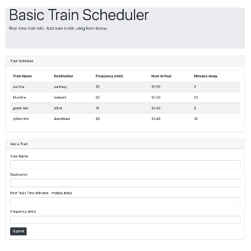

# train-scheduler-basic
A train schedule application that incorporates Firebase to host arrival and departure data. The app retrieves and manipulates this information with Moment.js. The website provides up-to-date information about various trains, namely their arrival times and how many minutes remain until they arrive at their station.

### How to Use
View web app to see when trains are departing & arriving. Use form to add a train to the schedule.  

## Built With
* [Bootstrap](https://getbootstrap.com/) - responsive framework for web
* Javascript
* JQuery
* [Moment.js](https://momentjs.com/) - Parse, validate, manipulate, and display dates and times in JavaScript
* [Firebase](https://firebase.google.com/) - a comprehensive app development platform by Google

## Versioning & Author
This is the only version and is maintained by me, [sabomade](https://github.com/sabomade).

## Acknowledgements
Built & completed as part of the UCB Coding Bootcamp, Homework 7: Firebase (option 1)

